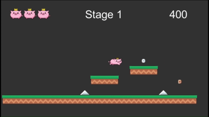

# GgulRun

도심을 배경으로 왕관을 쓴 돼지 캐릭터가 장애물을 피하고 아이템을 획득하며 회사 밖으로 탈출하는 Unity 2D 플랫포머 게임입니다.

  

## Game Concept

- 장르: 2D Platformer / Runner
- 개발 엔진: Unity
- 개발 언어: C#
- 배경: 현대 도심 및 회사
- 플레이어 캐릭터: 왕관을 쓴 돼지
- 목표: 장애물과 적을 피해 비상구에 도달하여 다음 스테이지로 이동
  

## AI-Assisted Asset Creation

본 프로젝트에서는 생성형 AI를 활용하여 게임의 콘셉트에 맞는 2D 에셋을 제작하고, Unity에서 사용할 수 있도록 수정·가공했습니다.

### 제작한 에셋

- 왕관을 쓴 돼지 플레이어 캐릭터
- Idle, Walk, Jump, Ascending 애니메이션 스프라이트
- 남성 부장 적 캐릭터
- 여성 매니저 적 캐릭터
- 회사 비상구 형태의 스테이지 종료 오브젝트
- 도심 및 회사 분위기에 맞는 게임 오브젝트

### 제작 과정

1. 게임의 세계관과 캐릭터 콘셉트를 정의했습니다.
2. 생성형 AI를 활용해 캐릭터와 오브젝트의 초기 시안을 제작했습니다.
3. 생성된 결과물을 게임의 픽셀아트 및 SD 스타일에 맞게 반복적으로 수정했습니다.
4. Unity Sprite Editor에서 사용할 수 있도록 프레임 크기, 배치, Pivot, 투명 배경 등을 조정했습니다.
5. 애니메이션 재생 시 캐릭터가 흔들리지 않도록 각 프레임의 위치와 크기를 통일했습니다.

AI가 생성한 이미지를 그대로 사용하는 데 그치지 않고, 게임 플레이와 Unity 환경에 적합하도록 디자인 요구사항을 정의하고 반복적으로 개선했습니다.
